# Zombolog App

Zombolog App e um companion mobile para jogadores de Project Zomboid. O app organiza fichas de sobreviventes, acompanha dias de sobrevivencia e zumbis abatidos, registra profissao, cidades, tracos e habilidades, e oferece um fluxo guiado para criar ou editar personagens.

O projeto usa React Native com Expo, TypeScript e Expo Router, seguindo uma arquitetura por features documentada em [`docs/architecture.md`](docs/architecture.md).

## Navegacao de Telas

### Entrada

O fluxo inicia pela autenticacao do usuario, com acesso as fichas salvas.

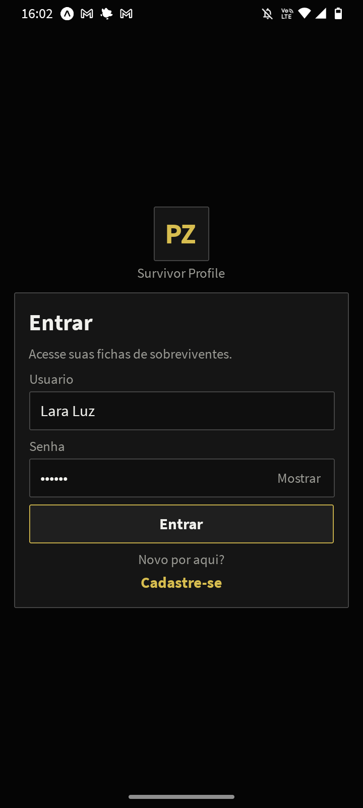

### Home

A Home lista os personagens cadastrados, destaca status, profissao, dias de sobrevivencia, zumbis abatidos e cidade atual. A partir dela, o usuario acessa a ficha de um personagem ou inicia a criacao de um novo.

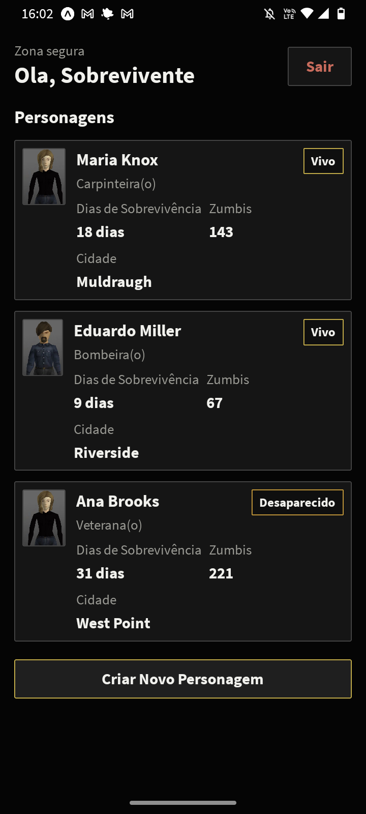

### Ficha do Personagem

A ficha mostra o resumo do sobrevivente, dados principais da run, secoes de habilidades e tracos, alem da acao de editar personagem.

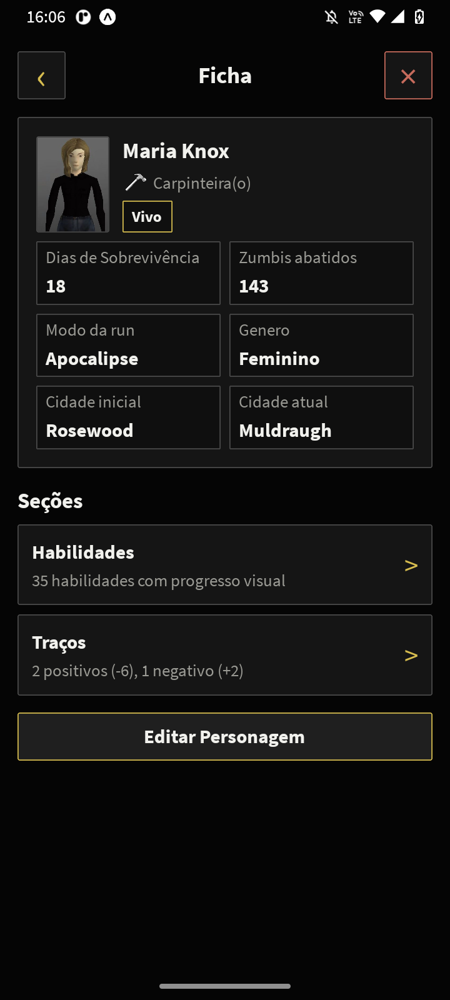

### Criacao e Edicao

O cadastro e a edicao usam um wizard de sete etapas para preencher informacoes basicas, profissao, aparencia, localizacao, tracos, habilidades e resumo final.

| Informacoes basicas | Profissao |
| --- | --- |
| 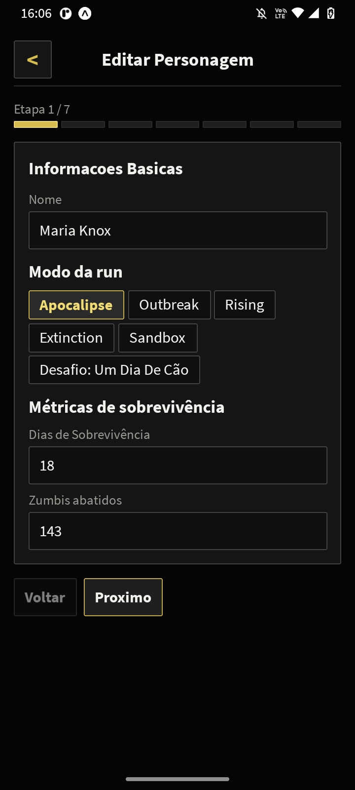 | 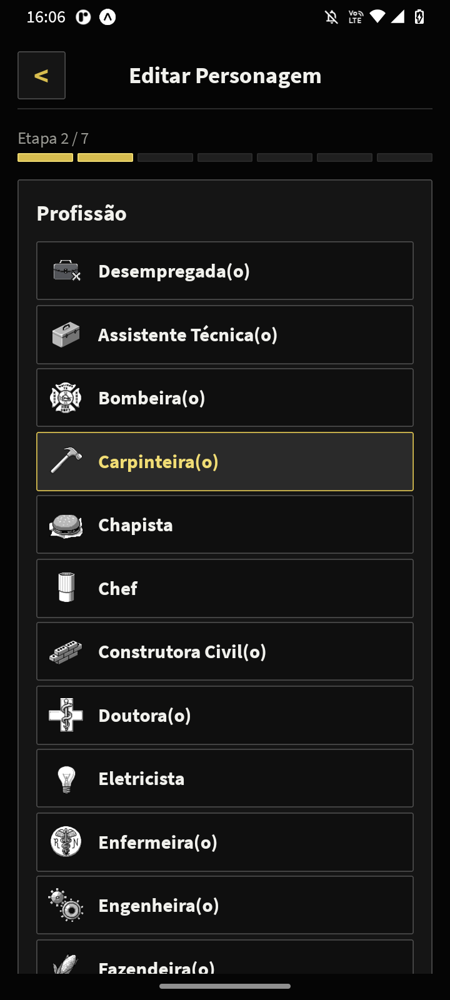 |

| Aparencia | Localizacao |
| --- | --- |
| 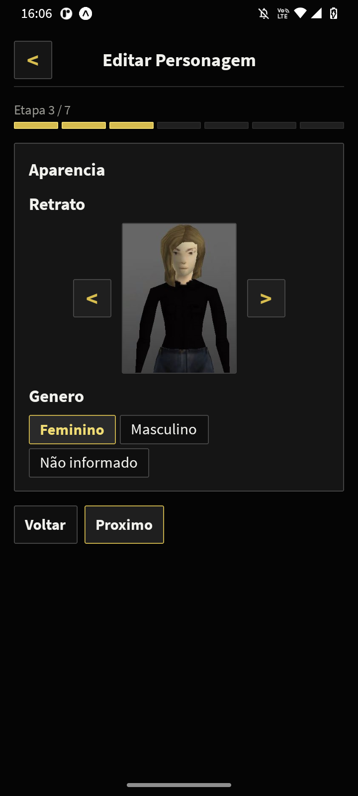 | 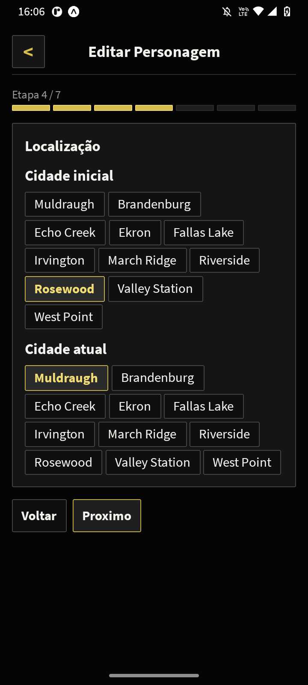 |

| Tracos positivos | Tracos negativos |
| --- | --- |
| 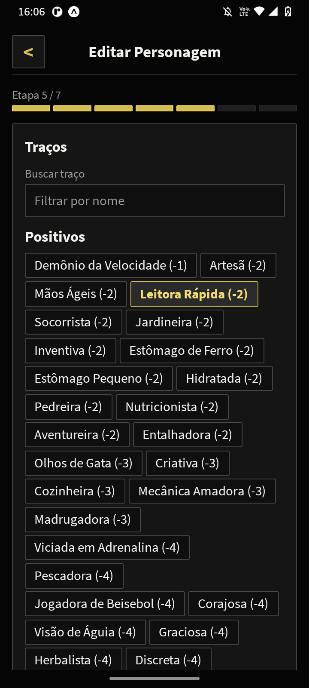 | 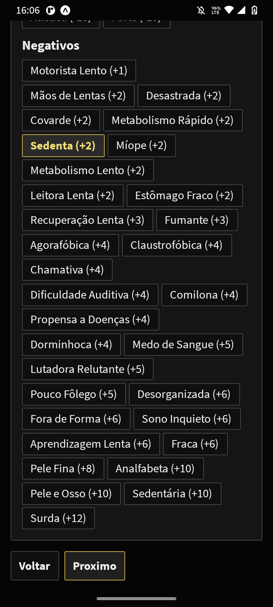 |

| Habilidades | Resumo |
| --- | --- |
| 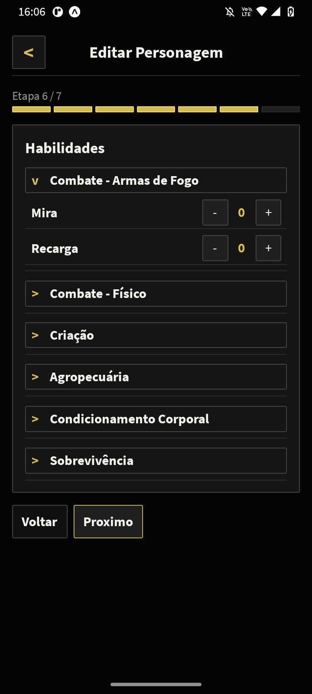 | 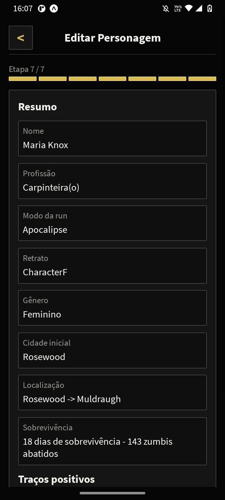 |

### Revisao Final

Antes de salvar, o usuario revisa os dados principais e os tracos escolhidos. As telas tambem demonstram a edicao de valores de habilidades e a continuidade do fluxo.

| Resumo com tracos | Habilidades preenchidas |
| --- | --- |
| 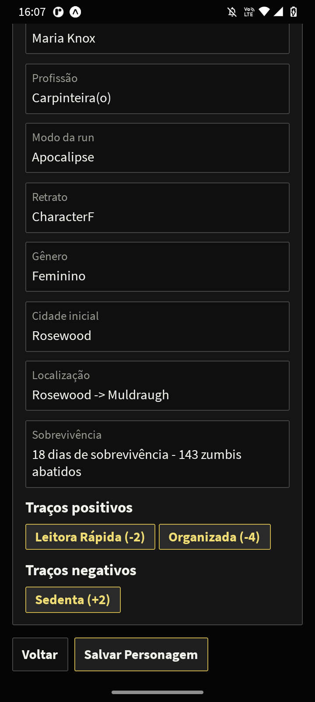 | 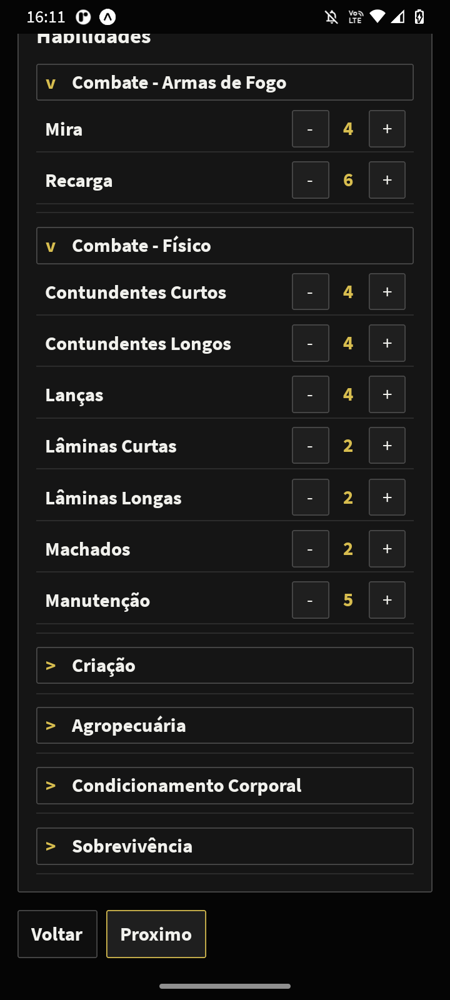 |

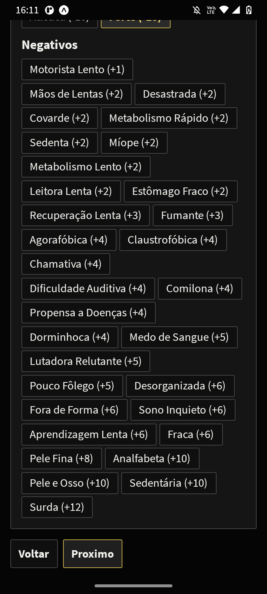

## License

Copyright (c) 2026 Lara Luz. All rights reserved.

This project is proprietary. No part of this code may be copied, modified, distributed, published, sold, sublicensed, reused, or used to create derivative works without prior written permission from the author.

## Licenca

Copyright (c) 2026 Lara Luz. Todos os direitos reservados.

Este projeto e proprietario. Nenhuma parte deste codigo pode ser copiada, modificada, distribuida, publicada, vendida, sublicenciada, reutilizada ou utilizada para criar obras derivadas sem autorizacao previa e por escrito da autora.
